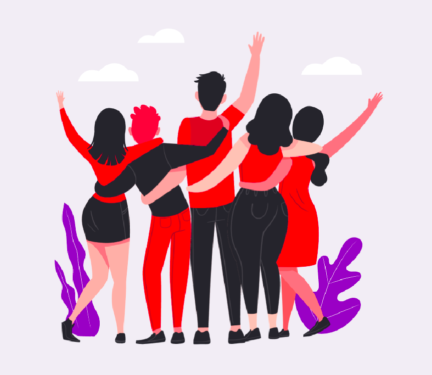

# BeTheHero

* Aplicação Web e Mobile desenvolvida durante a Semana OmniStack 11.0. Este projeto tem o intuito de ONGs cadastrarem a si próprias e seus respectivos casos na versão Web. Na versão Mobile, as pessoas podem procurar por qual caso elas querem ajudar fazendo uma doação.

## Aplicação FullStack completa:
* Back-end
* Front-end (Web)
* Mobile

## Principais tecnologias utilizadas:
* NodeJS
* ReactJS
* React Native