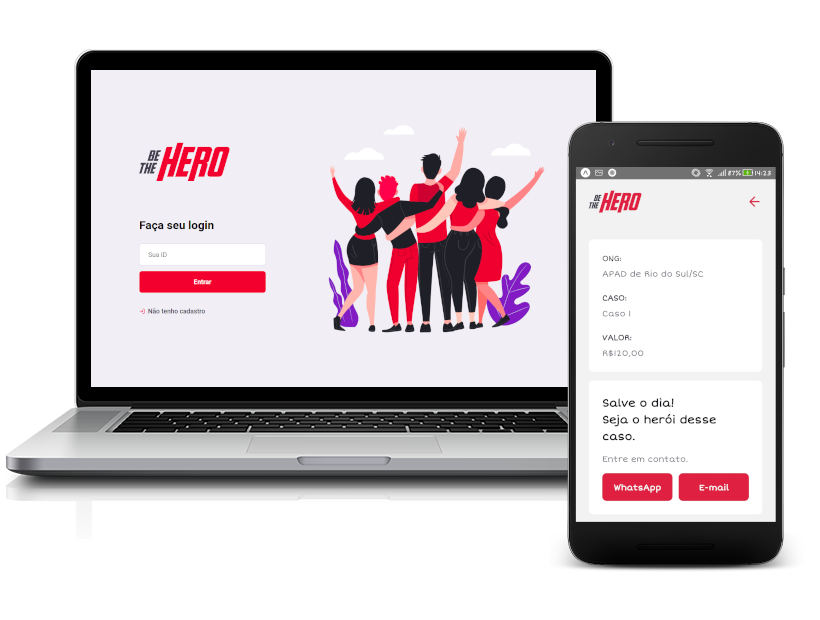

<h1 align="center">
  
</h1>

  

## :computer: Projeto

Aplicação Web e Mobile desenvolvida durante a Semana OmniStack 11.0. Este projeto tem o intuito de ONGs cadastrarem a si próprias e seus respectivos casos na versão Web. Na versão Mobile, as pessoas podem procurar por qual caso elas querem ajudar fazendo uma doação.

## :zap: Tecnologias

* Node.js
* ReactJS
* React Native
* Expo

## :heavy_check_mark: Aplicação FullStack Completa

* Backend
* Front-Web
* Front-Mobile
